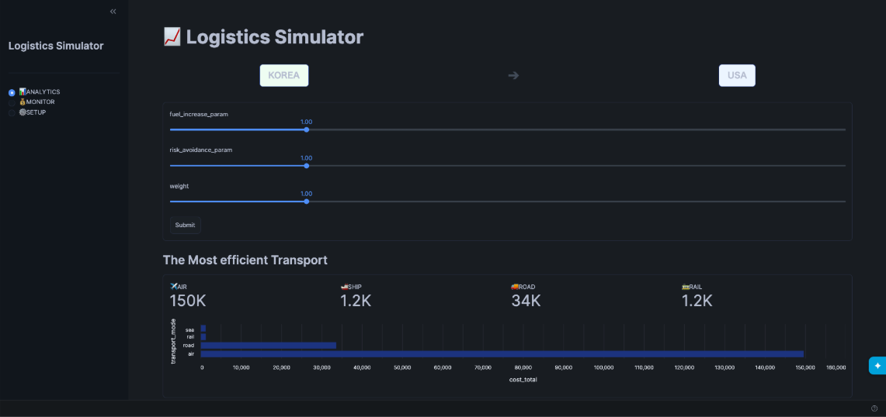
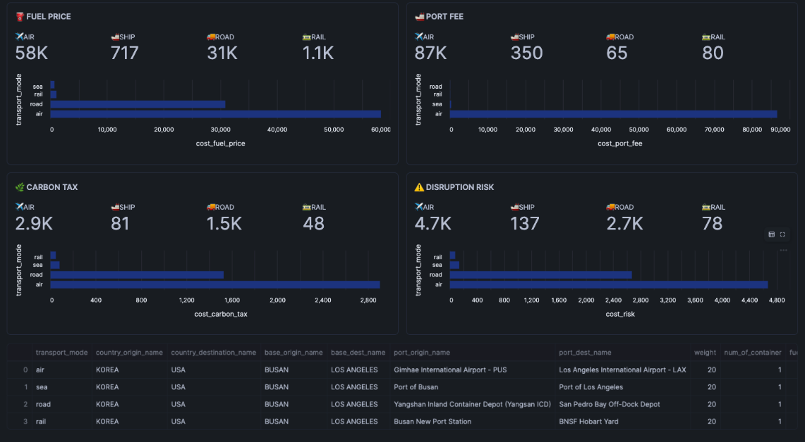
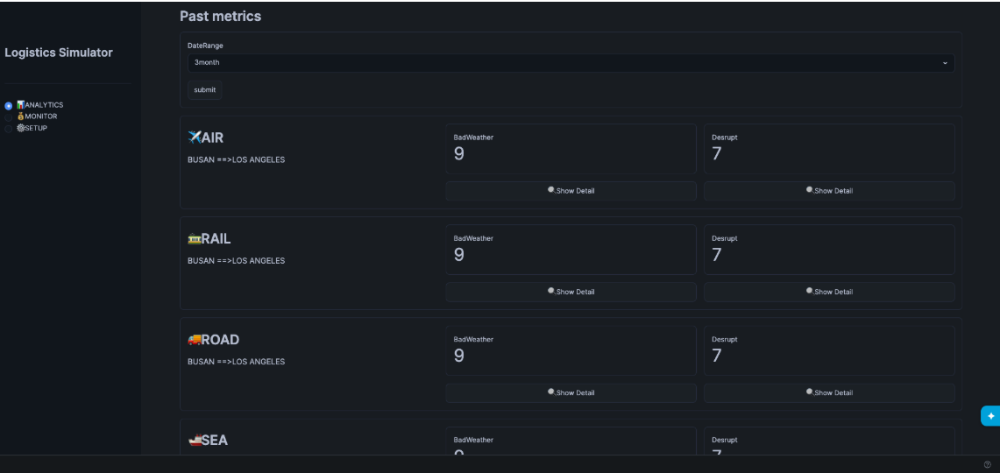
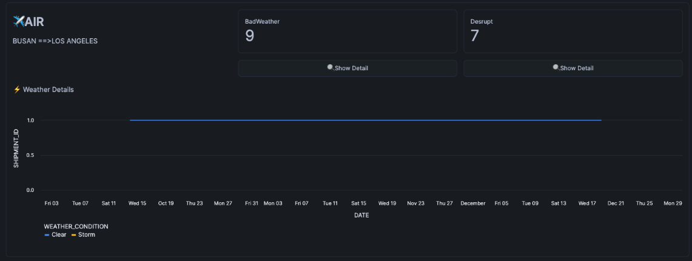
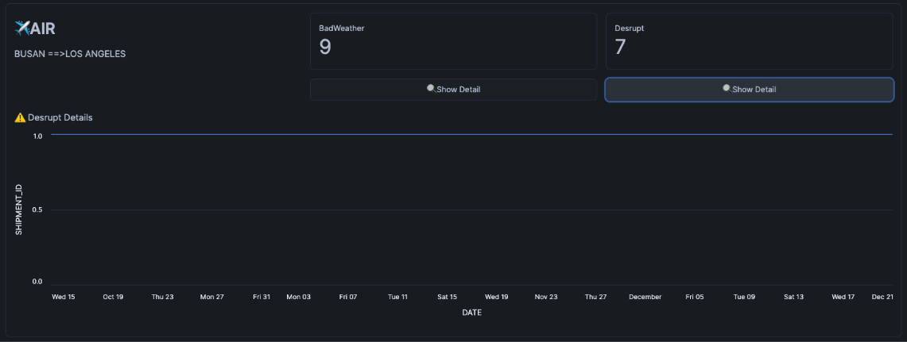
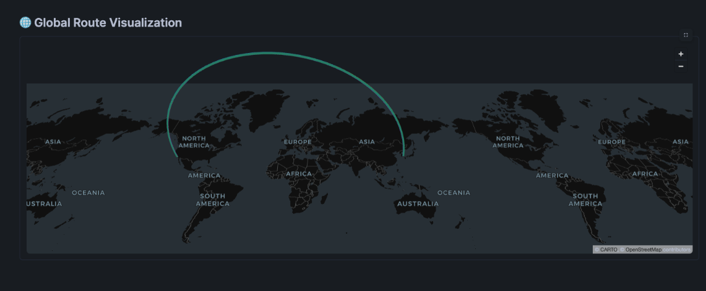
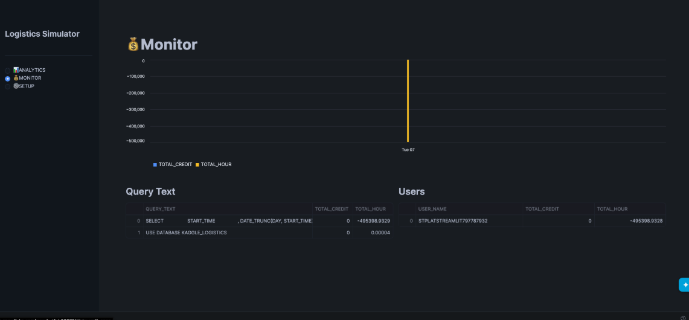
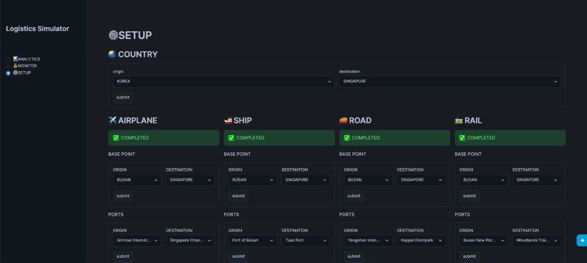

# olist_cohort_analytics_snowflake

## Project Executive Summary
I deployed this DataAnalytics Environment for the Olist Ecommerce data obtained from Kaggle.

This project includes features below

1. Python script which can create Table from Zip file uploaded to stage manually
2. Visualize the data with streamlit

## Streamlit OverView
This Logistics Simulator is already implemented in your snowflake environment   
[KAGGLE_LOGISTICS.DEV_ANALYTICS] and The Available role is above SYSADMIN Role. 

Here’s the description of each feature.

### ANALYTICS PAGE
The Most efficient Transport
On the top, shows the origin country and destination country and form section to setup the cost factor parameters fuel_increase_param, risk_avoidance_paramm weight. 

  
  
Showing the total_cost of each transport mode above.

These are The detail of each cost which is used in total_cost calculation and changed by setting up the params on the top.  

#### Past metrics
Showing the 2 metrics [BadWeather], [Desrupt] to check the actual past history.
Detail chart will be shown by clicking 🔍Show Detail . The metrics and chart is calculated by the daterange setted up above.  
※Each metrics is aggregated with the base point grain level.    
  
  

#### Global Route Visualization  
To Show the origin and destination port place.

  

### MONITOR PAGE
#### Monitor
Showing the consumed credits in this Streamlit app. The data is from INFORMATION_SCHEMA and this view doesn’t have specific columns of credit so that I calculated it based WAREHOUSE TYPE and usage time.  

You can get the collect credit information from ACCOUNT_USAGE but the data synchronize needs 1hour to 1 day. ※INFORMATION_SCHEMA remains only for 7days so this view only have the consumed credit in latest 7 days.

### SETUP PAGE
#### Setup
Setup country, base point, port and each vehicle attribution here. You cannot see Analytics Page without setting up here.  

## System Architecture Diagram
※The tables and views are transformed by dbt workflow

```mermaid
graph TD
    A[Kaggle / Olist Compressed Zip] -->|Manual Stage Allocation| B(Snowflake Internal Stage)
    B -->|Encrypted File Stream Access| C[Snowpark Python Engine]
    C -->|In-Memory Chunked Streaming| D[Snowflake Compute Pushdown]
    D -->|High-Throughput Bulk Insertion| E[(Snowflake Database: RAW Layer)]
    
    subgraph GitHub Actions Pipeline
        F[GitHub CI Runner] -->|Asymmetric RSA-2048 Key-Pair Handshake| D
    end

    style B fill:#333,stroke:#29B6F6,stroke-width:2px;
    style D fill:#1A237E,stroke:#29B6F6,stroke-width:2px;
    style E fill:#0D47A1,stroke:#FFF,stroke-width:2px;
```

## Core Engineering Highlights
### Class based architecture
### 
