# olist_cohort_analytics_snowflake

## Project Executive Summary
I deployed this DataAnalytics Environment for the Olist Ecommerce data obtained from Kaggle.

This project includes features below

1. Python script which can create Table from Zip file uploaded to stage manually
2. Visualize the data with streamlit

## Streamlit

## System Architecture Diagram
※The tables and views are transformed by dbt workflow

```mermaid
graph TD
    A[Kaggle / Olist Compressed Zip] -->|Manual Stage Allocation| B(Snowflake Internal Stage)
    B -->|Encrypted File Stream Access| C[Snowpark Python Engine]
    C -->|In-Memory Chunked Streaming| D[Snowflake Compute Pushdown]
    D -->|High-Throughput Bulk Insertion| E[(Snowflake Database: RAW Layer)]
    
    subgraph GitHub Actions Pipeline
        F[GitHub CI Runner] -->|Asymmetric RSA-2048 Key-Pair Handshake| D
    end

    style B fill:#333,stroke:#29B6F6,stroke-width:2px;
    style D fill:#1A237E,stroke:#29B6F6,stroke-width:2px;
    style E fill:#0D47A1,stroke:#FFF,stroke-width:2px;
```

## Core Engineering Highlights
### FileStream for creating Table from Zip
First of all, Snowflake can decompress the files compressed into the specific file formats aside from ZIP, such as GZIP, BZ2, BROTLI, ZSTD.

Zip is not supported since Zip can hold several files into one.
My Python Script can create table from zip file.

This Script can create the table from zip file in best way. It calls Snowpark Library which leverage Snowflake's Virtual Data Warehouse. It significantly optimise credit consumption.

